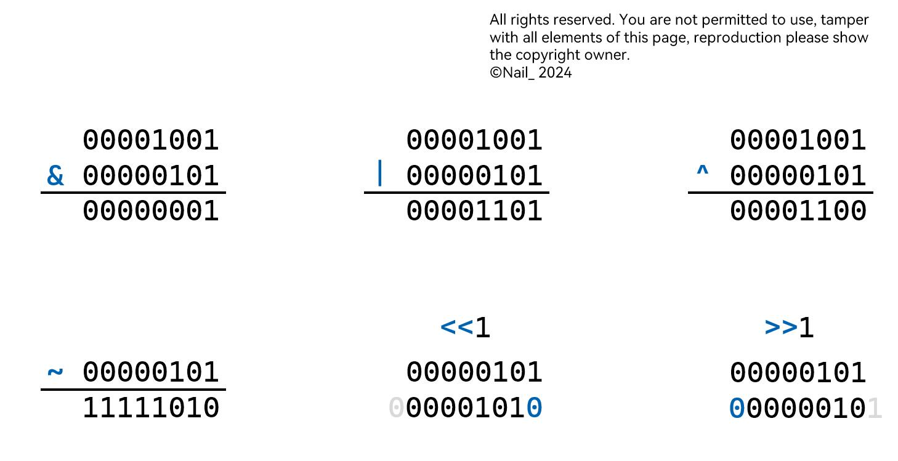

# 位运算

## 运算符

| 符号 | 语法 | 名称 | 含义 |
|:---:|---|---|---|
| & | $a$ & $b$ | 按位与 | 均为 $1$ 时才是 $1$，否则是 $0$；只要有 $0$，就是 $0$ |
| $\mid$ | $a\mid b$ | 按位或 | 均为 $0$ 时才是 $0$，否则是 $1$；只要有 $1$，就是 $1$ |
| ^ | $a$ ^ $b$ | 按位异或 | 相同是 $0$ ，不同是 $1$；$1$ ^ $1=0$ ^ $0=0$，$1$ ^ $0=0$ ^ $1=1$ |
| ~ | ~ $x$ | 取反 | 每一位都取相反数 |
| << | $a$ << $val$ | 左移 | 向左移，不足补 $0$，多余去除 |
| >> | $a$ >> $val$ | 右移 | 向左移，不足补 $0$，多余去除 |



[view.jpg](wys/image.jpg) | [ori.png](wys/image.png) | [ori.svg](wys/image.svg)

!!! warning ""

    特别地，对于负数的右移运算：

    ```cpp
    #include <bits/stdc++.h>
    using namespace std;

    int main(){
        signed a=9,b=-9;
        printf("%d %d %d %d",a>>1,b>>1,a>>2,b>>2);
        return 0;
        // output: 4 -5 2 -3
    }
    ```

## 常用技巧

### 乘/除以 2 的幂次

- 除：`257>>4` 等同于 `257/pow(2,4)`；
- 乘：`3<<4` 等同于 `3*pow(2,4)`；
- 常用 `a<<=1` 代表 `a*=2`；常用 `a>>=1` 代表 `a/=2`。

```cpp
#include <bits/stdc++.h>
using namespace std;

int main(){
    printf("%d %d",257>>4,3<<4);
    return 0;
    // output: 16 48
}
```

!!! warning ""

    同样地，**特别注意**右移对于负数的取整方式，负数的左移：

    ```cpp
    #include <bits/stdc++.h>
    using namespace std;

    int main(){
        printf("%d %d\n",(-257)>>4,257>>4);
        printf("%d %d",(-3)<<4,3<<4);
        return 0;
        // warning on line 6 colum 21:
        // [警告] left shift of negative value [-Wshift-negative-value]
        /**
        * output: 
        * -17 16
        * -48 48
        */
    }
    ```

### 交换两数

交换两数建议使用 `swap()` 函数（非常强大），或者定义第三个变量临时存储，较为常用。  
使用和差交换或者位运算交换可能会导致溢出，不建议使用。

<div class="grid" markdown>

```cpp
a = a ^ b;
b = a ^ b;
a = a ^ b;
```

```cpp
a ^= b;
b ^= a;
a ^= b;
```

</div>

这里用到的**按位异或**性质：

- 相同的数按位异或为 $0$
- 任何数按位异或 $0$ 都是它本身
- 按位异或符合交换律、结合律

第7行展开写是 `b' = a' ^ b' = (a ^ b) ^ b = a ^ (b ^ b) = a ^ 0 = a`；  
第8行展开写是 `a' = a' ^ b' = (a ^ b) ^ a = b ^ (a ^ a) = b ^ 0 = b`。  
（没带 `'` 的是原始变量）

### 常见应用

- **二分查找**中，对于左边界 $l$ 和右边界 $r$，使用 `(l + r) >> 1` 或 `l + (r - l) >> 1`（后者减小溢出情况）来计算中间点 $m = \frac{l + r}{2}$；
- **树状数组**中，使用 `x&(-x)` 代表 `lowbit(x)`；
- **线段树**中，对于存储在 $d_p$ 中的节点，它的两个子节点的下标分别为 `p >> 1` 和 `p >> 1 | 1`。

## 基本例题

### 判断是否是 2 的幂

力扣链接：[231. Power of Two](https://leetcode.com/problems/power-of-two/description/)

一个数是 $2$ 的幂，其二进制必须是一个 `1` 加上若干个 `0` ，如 `1000` 。满足这个数减去 $1$ 后每一位都与原数不同。如对于 $2$ 的 $4$ 次方 $16$ ：

```text
  10000 => 16
& 01111 => 16-1
-------
  00000 => 0
```

原理可参考 [#法1 - 按位与运算](#法1---按位与运算)。

```cpp
class Solution {
public:
    bool isPowerOfTwo(int n) {
        return (n>0) && (n&(n-1))==0;
    }
};
```

### 二进制中 1 的个数

力扣链接：[191. Number of 1 Bits](https://leetcode.com/problems/number-of-1-bits/description/)

#### 法1 - 按位与运算

与 [#判断是否是 $2$ 的幂](#判断是否是-2-的幂) 类似，通过语句 `a&(a-1)` 可以消去这个数二进制最低位的 `1` ，以 $14$ 举例：

```text
  011 10 => 14
& 011 01 => 14-1
----- --
  011 00
```

可以看到，减去 $1$ 后与前面的部分（`011`）无关（上下每位都相同），后面的部分每位都上下不同。按位与这两个数会保留前面的部分，后面的部分全部置 `0`，因此涉及到的一个 `1` 被消为 `0`。

因此，可以得出：

- 消去一个数二进制最右侧的 `1`： `a&(a-1)`；
- 获取一个数二进制最右侧的 `1`： `a&(~a+1)` 或 `a&(-a)`（即 `lowbit(x)`）。

!!! info ""

    `-a` 表示 `a` 的补码。

```cpp
class Solution {
public:
    int hammingWeight(int n) {
        long long int count = 0;
        while(n) {
            count++;
            n&=(n-1);
        }
        return count;
    }
};
```

#### 法2 - 每一位判断

每次判断最低位是否为 `1`，并右移移掉最低位，直到移为 $0$。

```cpp
class Solution {
public:
    int hammingWeight(int n) {
        long long int count = 0;
        while(n) {
            count += n&1;
            n>>=1;
        }
        return count;
    }
};
```

转化成不用位运算的方式：

```cpp
class Solution {
public:
    int hammingWeight(int n) {
        long long int count = 0;
        while(n) {
            count += n%2;
            n/=2;
        }
        return count;
    }
};
```

### 二进制是否 0 1 交替

力扣链接：[693. Binary Number with Alternating Bits](https://leetcode.com/problems/binary-number-with-alternating-bits/description/)

每次判断相邻的两位是否是 `01` 或者 `10`。  
通过对该数按位与运算 $3$ 即可（ $3$ 对应的二进制为 `11`）。如果该数最后两位为 `10`，则按位与结果为 `10`；最后两位为 `01`，则按位与结果为 `01`。否则都不满足。  
然后把该数右移 $1$ 位，继续检查最后两个二进制位。

```cpp
class Solution {
public:
    bool hasAlternatingBits(int n) {
        while(n) {
            if((n&3)!=2 && (n&3)!=1)
                return false;
            n>>=1;
        }
        return true;
    }
};
```

## 练习题

### LCsingle-number-iii

力扣链接：[260. Single Number III](https://leetcode.com/problems/single-number-iii/description/)

### P1226

洛谷链接：[P1226 【模板】快速幂](https://www.luogu.com.cn/problem/P1226)

???+ info "AC code"

    ```cpp title="快速幂模板" hl_lines="10-14"
    #include <bits/stdc++.h>
    #define lli long long int
    using namespace std;

    int main() {
        lli a, b, p;
        scanf("%lld%lld%lld", &a, &b, &p);
        printf("%lld^%lld mod %lld=", a, b, p);
        lli res = 1;
        while(b) {
            if(b & 1) (res *= a) %= p;
            (a *= a) %= p;
            b >>= 1;
        }
        printf("%lld", res % p);
        return 0;
    }
    ```

### P10118

洛谷链接：[P10118 『STA - R4』And](https://www.luogu.com.cn/problem/P10118)

???+ info "STD 题解"

    from: [『STA - R4』 T1 题解](https://www.luogu.com.cn/article/9lrde6zo)

    可以发现，$x \operatorname{AND} y$ 对应了在二进制加法中进位的位置集合，$x \operatorname{XOR} y$ 对应了结果中为 $1$ 但是没有进位的位置集合。因此，通过用位运算模拟加法的过程，我们可以得出

    $$x + y = 2 \times \left(x \operatorname{AND} y\right) + x \operatorname{XOR} y$$

    因为已知 $x + y$ 和 $x \operatorname{AND} y$，因此可以得到 $x \operatorname{XOR} y$，设为 $C$。

    那么所有可能的合法数对可以通过将 $C$ 二进制下的 $1$ 分配给 $x$ 或 $y$ 得到。注意到若 $C \operatorname{AND} B$ 不为 $0$ 那么不存在合法的分配方案，此时应按无解处理。

    通过一些观察可以发现 $C$ 二进制下最高位的 $1$ 一定分配给 $y$，否则无法保证 $x \le y$。在这之后的所有情况均合法，所以可以发现对于一种方案，将 $C$ 二进制下除最高位的其他位分配方案取反，得到的方案也是合法的，且与原方案互补。

    所以只会有 $C$ 二进制下最高位的 $1$ 产生贡献，贡献系数为剩余位数的方案数，即 $2 ^{\operatorname{popcount}\left(C\right) - 1}$。

    因此我们可以在 $\mathcal{O}\left(1\right)$ 的时间内回答每组询问。
