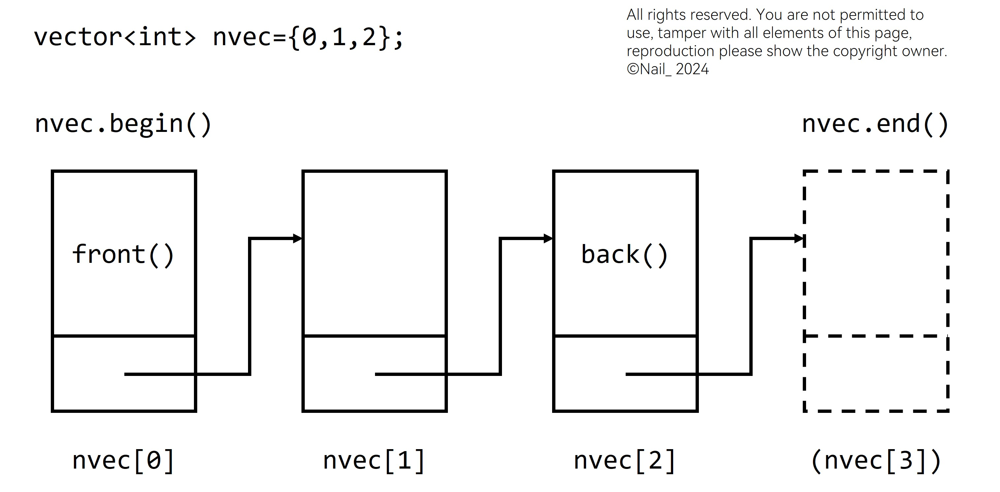

# STL 容器用法汇总

## STL 函数

${\color{Green} \texttt{RET}}$ `min(x,y)` `min({x1,x2,x3,...})`  
求所有元素的最小值  
${\color{Green} \texttt{RET}}$ `max(x,y)` `max({x1,x2,x3,...})`  
求所有元素的最大值

${\color{Orange} \texttt{CHA}}$ `swap(x,y)`  
交换两个元素

${\color{Orange} \texttt{CHA}}$ `sort(ibegin,iend,fcomp)`  
使用含快速排序的复合排序对序列排序，默认升序  
${\color{Orange} \texttt{CHA}}$ `stable_sort(ibegin,iend,fcomp)`  
使用归并排序对序列稳定排序，默认升序

${\color{Green} \texttt{RET}}$ `lower_bound(ibegin,iend,x)`  
用二分查找，返回有序序列中第一个大于等于 $x$ 的元素迭代器  
${\color{Green} \texttt{RET}}$ `upper_bound(ibegin,iend,x)`  
用二分查找，返回有序序列中第一个大于 $x$ 的元素迭代器

${\color{Green} \texttt{RET}}$ `find(ibegin,iend,x)`  
返回区间[ibegin,iend)第一个为 $x$ 的元素迭代器，未找到则返回 $iend$

${\color{Green} \texttt{RET}}$ `count(ibegin,iend,x)`  
返回区间[ibegin,iend)中为 $x$ 的元素数量

${\color{Orange} \texttt{CHA}}$ `reverse(ibegin,iend)`  
把序列翻转

${\color{Orange} \texttt{CHA}}$ `fill(ibegin,iend,val)`  
将区间[ibegin,iend)中所有元素设为 $val$

${\color{Gray} \texttt{CHA}}$ `unique(ibegin,iend)`  
将连续的相同元素合并为一个元素，返回 $iend$

${\color{Gray} \texttt{CHA}}$ `nth_element(ibegin,ibegin+k,iend,fcomp)`  
使区间 $[begin,end)$ 第 $k$ 小的元素处在第 $k$ 个位置上，左边元素都小于或等于它，右边元素都大于或等于它，但并不保证其他元素有序

${\color{Gray} \texttt{CHA}}$ `next_permutation(ibegin,iend,fcomp)`  
序列的下一个全排列，返回 bool 类型：是否有下一个全排列  
${\color{Gray} \texttt{CHA}}$ `prev_permutation(ibegin,iend,fcomp)`  
序列的上一个全排列，返回 bool 类型：是否有上一个全排列

${\color{Gray} \texttt{CHA}}$ `random_shuffle(ibegin,iend)`  
随机打乱序列

---

## STL 容器

### 普通函数

${\color{Green} \texttt{RET}}$ `stl.begin()`  
返回容器第一个元素的迭代器  
${\color{Green} \texttt{RET}}$ `stl.end()`  
返回容器最后一个元素的下一个迭代器

${\color{Green} \texttt{RET}}$ `stl.front()`  
返回容器第一个元素的值  
${\color{Green} \texttt{RET}}$ `stl.back()`  
返回容器最后一个元素的值 (1)
{ .annotate }

1.  以上 $4$ 种函数的区别参见下文 [#迭代器](#迭代器)。

${\color{Green} \texttt{RET}}$ `stl.size()`  
返回容器的长度

${\color{Gray} \texttt{CHA}}$ `stl1.swap(stl2)`  
交换两容器

### 序列式容器

#### vector 向量

尾部可高效增加元素的顺序表

#### string 字符串

`str.size()`还有其他 STL 获取长度都是 $O(1)$ ，而 `strlen(a)` 是 $O(N)$

不建议用 `scanf` 输入，输出为 `printf("%s",str.c_str());`

#### [UL] array 数组

定长的顺序表，C 风格数组的简单包装

#### deque 双端队列

**d**ouble **e**nded **que**ue，双端都可高效增加元素的顺序表

#### [UL] list 列表

可以沿双向遍历的链表

与[deque](#deque-双端队列)用法基本相同，但更擅长非头尾的插入和删除  

- [ ] 使用数组表示法和随机访问
- [x] 迭代器双向访问
- [x] 在任何位置插入或删除元素，操作速度都很快

#### [UL] forward_list 单向列表

只能沿一个方向遍历的链表

与 [list](#ul-list-列表) 类似，但减少了内存开销。无双向遍历要求建议替换 [list](#ul-list-列表) 为 [forward_list](#ul-forward_list-单向列表)

### 关联式容器

#### set 集合

用以**有序**地存储**互异**元素的容器。由节点组成的红黑树，每个节点都包含着一个元素，节点之间以某种比较元素大小的 谓词(1)进行排列
{ .annotate }

1.  谓词：返回值为真或者假的函数。STL 容器中经常会使用到谓词，用于模板参数。

#### multiset 多重集合

用以**有序**地存储元素的容器

#### map 映射

由 {键，值} 对组成的集合，以某种比较键大小关系的谓词进行排列

#### [UL] multimap 多重映射

由 {键，值} 对组成的多重集合，亦即允许键有相等情况的映射

### 无序关联式容器

使用哈希实现的无序关联式容器

`unordered_set` `unordered_multiset`  
元素无序，只关心元素是否存在

!!! note "关于 set 和 unordered_set"

    如果使用 set 或 unordered_set 会被卡常，可以尝试换成另一种。

`unordered_map` `unordered_multimap`  
键 (key) 无序，只关心键与值的对应关系

!!! note "关于 map 和 multimap"

    unordered_map 并没有对 pair 作适配，因此不能方便地使用 unordered_map 存放双哈希值。

### 容器适配器

容器适配器并不是容器，不具有容器的某些特点，如：迭代器、`clear()` 函数

#### [UL] stack 栈

后进先出（LIFO）的容器，默认是对[deque](#deque-双端队列)的包装

!!! note "from: 一扶苏一"

    STL 提供了 [stack](#ul-stack-栈) 作为封装好的栈，但是其底层内存分配逻辑是 [deque](#deque-双端队列)，常数极大。一般而言，如果希望用 STL 实现 [stack](#ul-stack-栈)，可以考虑使用 [vector](#vector-向量)。

#### queue 队列

先进先出（FIFO）的容器，默认是对[deque](#deque-双端队列)的包装

#### priority_queue 优先队列

元素的次序是由作用于所存储的值对上的某种谓词决定的的一种队列，默认是对向量 [vector](#vector-向量) 的包装

### 迭代器



[jpg file](stlrqyfhz/iterator.jpg) | [png file](stlrqyfhz/iterator.png) | [svg file](stlrqyfhz/iterator.svg) | [picture © 2024 NailFec](https://nailfec.github.io/NailFecDoc/%E5%8D%8F%E8%AE%AE/)

${\color{Orange} \texttt{CHA}}$ `advance(it, x)`  
$x$ 为正则向后移动，$x$ 为负则向前移动

${\color{Green} \texttt{RET}}$ `next(it)`  
**返回** $it$ 迭代器的下一个迭代器，但**不改变** $it$  
${\color{Green} \texttt{RET}}$ `prev(it)`  
**返回** $it$ 迭代器的上一个迭代器，但**不改变** $it$

!!! warning

    如果考试使用的 dev-c++ 不能使用 C++11，就用不了 `auto`，需要写完整的迭代器名，如 `vector<int>::iterator`。
    
    同时，循环中的 `:` 运算符也不能在 dev-c++ 上使用。
    
    因此，一个简单的遍历整个序列的循环正常的写法是这样的：

    ```cpp
    for(auto it : d)
        cerr << it.first << " " << it.second << "\n";
    ```

    但是用不了 C++11 的话需要这么写：

    ```cpp
    for(vector<pair<lli, lli> >::iterator it = d.begin(); it != d.end(); it ++)
        cerr << (*it).first << " " << (*it).second << "\n";
    ```

    当然，评测使用的版本大于等于 C++14，一般可以在编译指令中加入 `-std=c++14`。
