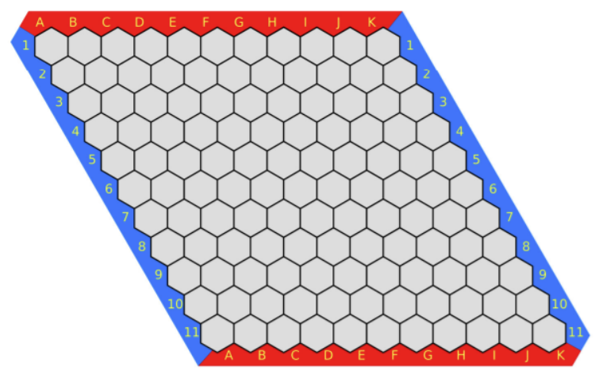

# 问题 H: 交错字符串

传送门：[ZWGOJ](http://81.68.64.169/problem.php?cid=1012&pid=7) | 字符串 Ad-Hoc

## 题目描述

### 原题面

给定三个字符串 $s_1$、$s_2$、$s_3$，请你帮忙验证 $s_3$ 是否是由 $s_1$ 和 $s_2$ 交错组成的。

两个字符串 $s$ 和 $t$ 交错的定义与过程如下，其中每个字符串都会被分割成若干非空子字符串：

- $s = s_1 + s_2 + \dots + s_n$
- $t = t_1 + t_2 + \dots + t_m$
- $|n - m| \le 1$

交错是 $s_1 + t_1 + s_2 + t_2 + s_3 + t_3 + \dots$ 或者 $t_1 + s_1 + t_2 + s_2 + t_3 + s_3 + \dots$

注意：$a + b$ 意味着字符串 $a$ 和 $b$ 连接。

<!-- { width="400" } -->
<center></center>
<!---->

### 输入要求

第一行，输入字符串$s_1$ $(1 \le |s_1| \le 1 \times 10^3)$。

第二行，输入字符串$s_2$ $(1 \le |s_2| \le 1 \times 10^3)$。

第三行，输入字符串$s_3$ $(1 \le |s_3| \le 1 \times 10^3)$。

### 输出要求

一行，如果是交错字符串，输出“$\texttt{yes}$”，否则输出“$\texttt{no}$”。

### 样例

<div class="grid" markdown>

```text
aabcc
dbbca
aadbbcbcac
```

```text
yes
```

</div>

<div class="grid" markdown>

```text
aabcc
dbbca
aadbbbaccc
```

```text
no
```

</div>

## 解法

解法和时间复杂度： (1)
{ .annotate }

1.  此处时间复杂度为该解法的**算法部分**的时间复杂度，不是严谨的**整题**的时间复杂度

<!---->
- 动态规划 $O(mn)$

### 动态规划

```cpp
#include <bits/stdc++.h>
using namespace std;
const int MAXn = 1000 + 9;
bool dp[MAXn][MAXn];

int main() {
    string s1, s2, s3;
    cin >> s1 >> s2 >> s3;
    int l1 = s1.length(), l2 = s2.length(), l3 = s3.length();
    if(l1 + l2 != l3) return 0 * printf("no");
    if(l1 == 0) return 0 * (s2 == s3 ? printf("yes") : printf("no"));
    if(l2 == 0) return 0 * (s1 == s3 ? printf("yes") : printf("no"));
    s1 = "#" + s1; s2 = "#" + s2; s3 = "#" + s3;
    dp[0][0] = true;
    for(int i = 0; i <= l1; i ++)
        for(int j = 0; j <= l2; j ++) {
            if(i != 0 && dp[i - 1][j] && s1[i] == s3[i + j]) dp[i][j] = true;
            if(j != 0 && dp[i][j - 1] && s2[j] == s3[i + j]) dp[i][j] = true;
        }
    dp[l1][l2] ? printf("yes") : printf("no");
    return 0;
}
```

此题可以使用**滚动数组**优化空间复杂度，代码略。
